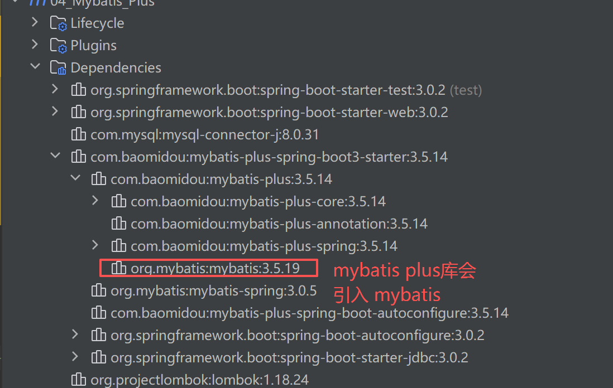
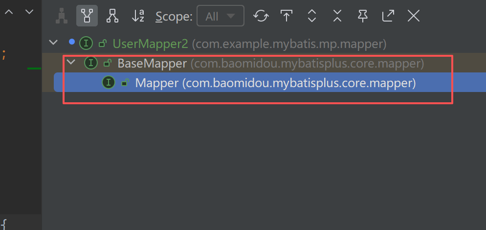
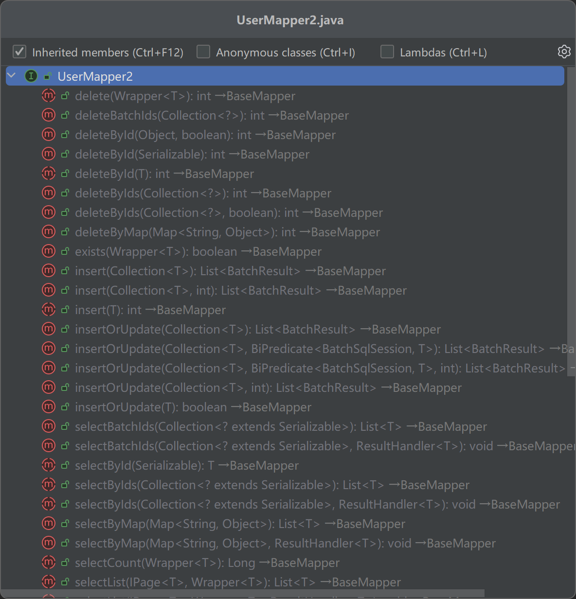

[toc]

# `Mybatis Plus`

`Mybatis Plus` 官网: https://baomidou.com/

官网案例数据: https://baomidou.com/getting-started/

```sql
DROP TABLE IF EXISTS `user`;

CREATE TABLE `user`
(
    id BIGINT NOT NULL COMMENT '主键ID',
    name VARCHAR(30) NULL DEFAULT NULL COMMENT '姓名',
    age INT NULL DEFAULT NULL COMMENT '年龄',
    email VARCHAR(50) NULL DEFAULT NULL COMMENT '邮箱',
    PRIMARY KEY (id)
);

DELETE FROM `user`;

INSERT INTO `user` (id, name, age, email) VALUES
                                              (1, 'Jone', 18, 'test1@baomidou.com'),
                                              (2, 'Jack', 20, 'test2@baomidou.com'),
                                              (3, 'Tom', 28, 'test3@baomidou.com'),
                                              (4, 'Sandy', 21, 'test4@baomidou.com'),
                                              (5, 'Billie', 24, 'test5@baomidou.com');
```


# 配置 `Mybatis Plus`

将 `pom.xml` 文件中的 `mybatis-spring-boot-starter` 依赖改为 `mybatis plus` 的依赖 `mybatis-plus-spring-boot3-starter`, `mybatis plus` 依赖中会引入 `mybatis` 的依赖;



```text
        <!-- mybatis依赖 -->
        <!--        <dependency>-->
        <!--            <groupId>org.mybatis</groupId>-->
        <!--            <artifactId>mybatis</artifactId>-->
        <!--            <version>3.5.9</version>-->
        <!--        </dependency>-->

        <!-- mybatis需要使用spring boot的依赖库 -->
        <!--        <dependency>-->
        <!--            <groupId>org.mybatis.spring.boot</groupId>-->
        <!--            <artifactId>mybatis-spring-boot-starter</artifactId>-->
        <!--            <version>2.3.1</version>-->
        <!--        </dependency>-->

        <!-- 导入 mp 库 -->
        <dependency>
            <groupId>com.baomidou</groupId>
            <artifactId>mybatis-plus-spring-boot3-starter</artifactId>
            <version>3.5.14</version>
        </dependency>
```

> `Spring Boot` 启动时的 `MyBatis Plus` logo 关闭

`Spring Boot` 启动时，会有如下的 `MyBatis Plus` 日志

```text
2025-11-17T23:59:56.061+08:00  INFO 23016 --- [           main] c.e.m.mp.MyBatisPlusBaseMapperTest       : No active profile set, falling back to 1 default profile: "default"
 _ _   |_  _ _|_. ___ _ |    _ 
| | |\/|_)(_| | |_\  |_)||_|_\ 
     /               |         
                        3.5.14 
2025-11-17T23:59:57.314+08:00  INFO 23016 --- [           main] o.s.b.a.w.s.WelcomePageHandlerMapping    : Addi
```

可以在 `yml` 文件中配置如下属性，关闭上述的logo;

```yaml
mybatis-plus:
  global-config:
    # 关闭启动时的 MyBatisPlus 符号
    banner: false
```


> 配置 `MyBatis Plus` 的控制台输出 SQL 日志

在 `yml` 文件内配置如下内容

```yaml
mybatis-plus:
  configuration:
    # 配置 MyBatis Plus 的日志输出
    log-impl: org.apache.ibatis.logging.stdout.StdOutImpl
```

可以在执行对应的`MyBatis Plus` 方法时，输出对应的数据库操作信息:

```text
2025-11-18T00:05:23.488+08:00  INFO 9764 --- [           main] com.zaxxer.hikari.HikariDataSource       : HikariPool-1 - Start completed.
JDBC Connection [HikariProxyConnection@407958234 wrapping com.mysql.cj.jdbc.ConnectionImpl@7b5833ee] will not be managed by Spring
==>  Preparing: UPDATE user SET name=?, age=?, email=? WHERE id=?
==> Parameters: lisi(String), 22(Integer), lisi@qq.com(String), 6(Long)
<==    Updates: 1
Closing non transactional SqlSession [org.apache.ibatis.session.defaults.DefaultSqlSession@5a3cf824]
```


## `Mybatis Plus` 使用 `BaseMapper` 实现增删改



```java
/**
 * 使用MyBatis Plus实现增删改的操作
 *
 * 创建 UserMapper2 接口，继承自 BaseMapper,
 * BaseMapper 内部定义了一系列的增删改操作方法，MyBatis 在扫描到对应方法后会创建对应方法的代理实现
 */
@Mapper
public interface UserMapper2 extends BaseMapper<User> {

}
```



