[toc]


# `Mybatis` 源码环境搭建

## 1. 下载 `mybatis-3` 和 `parent` 源码本地编译配置

### 1.1 下载 `mybatis-3` 和 `parent` 项目到本地目录下

项目仓库: https://github.com/orgs/mybatis/repositories

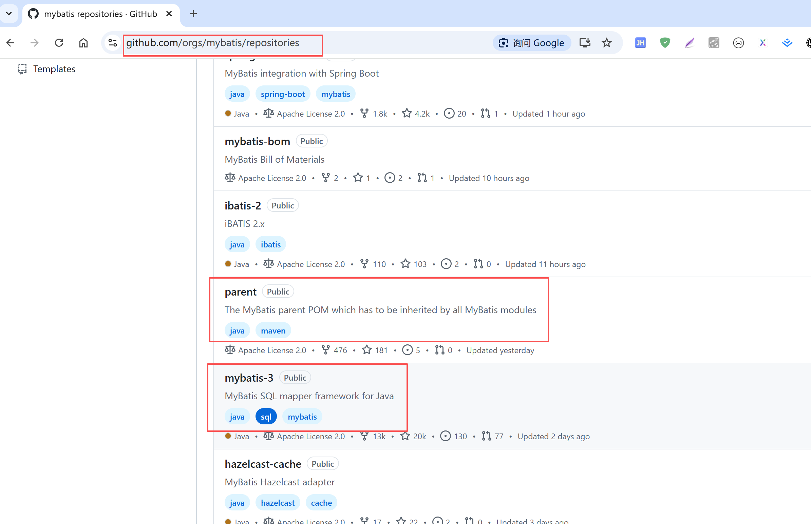

两个项目下载到同一个目录下

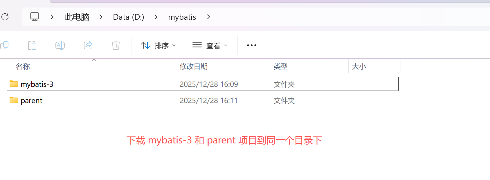


> 切换 `mybatis-3` 和 `parent` 的项目版本

- `mybatis-3`: 使用 `mybatis-3.5.16` tag 版本
- `parent`: 使用 `mybatis-parent-45` tag 版本

```text
# 查看所有的tag
git tag

# mybatis-3 切换到 mybatis-3.5.16 tag 版本
git checkout mybatis-3.5.16

# parent 项目切换到 mybatis-parent-45 tag 版本
git checkout mybatis-parent-45
```

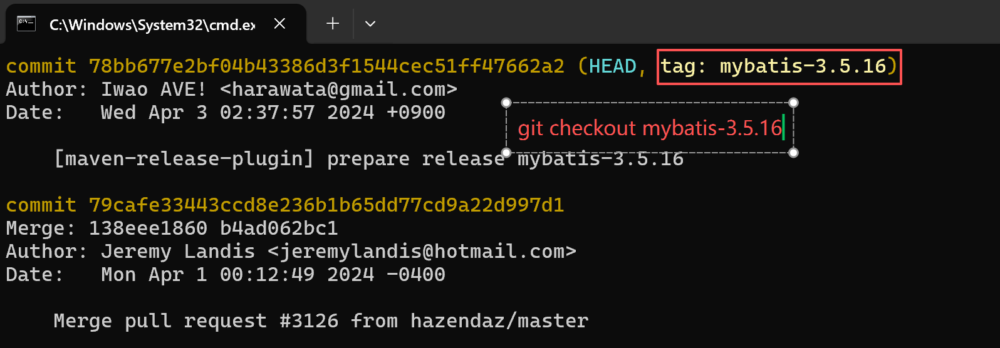

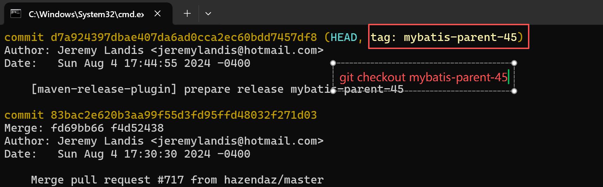


### 1.2 导入 parent 项目到 idea，编译

导入 `mybatis-parent` 到 idea 中，执行如下命令: 

```shell
mvn clean install
```

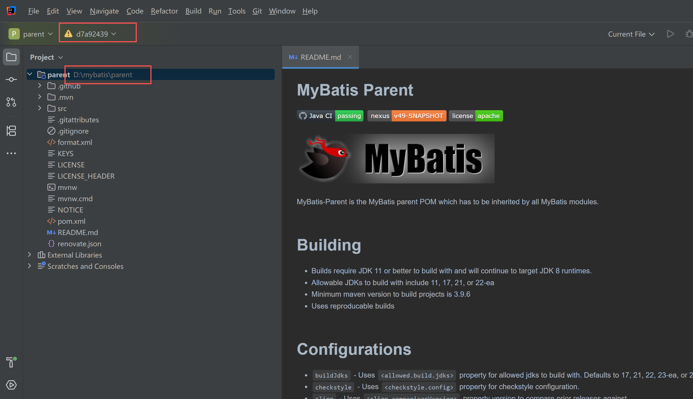

首次执行，由于我本地的 maven 版本是 `3.8.6`，执行遇到如下问题:

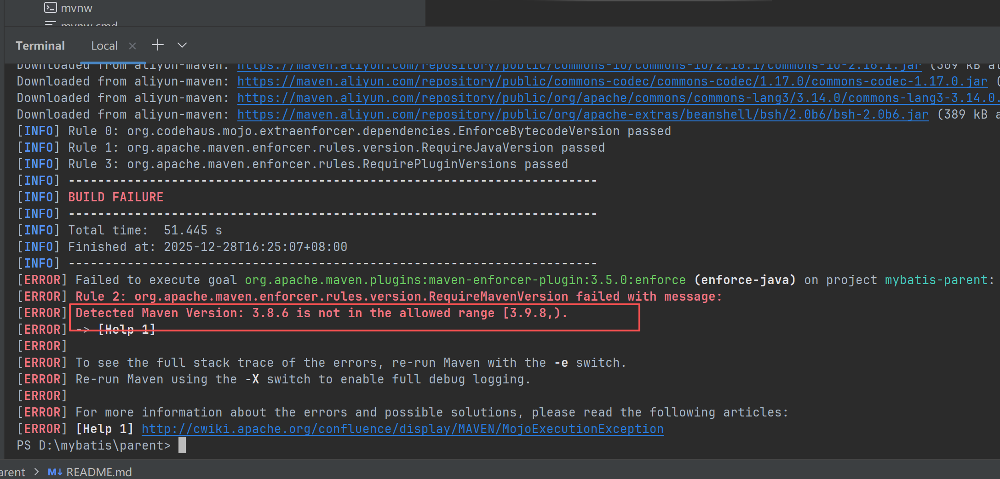

重新配置 `maven` 版本到 `3.9.9` 后执行上述命令:

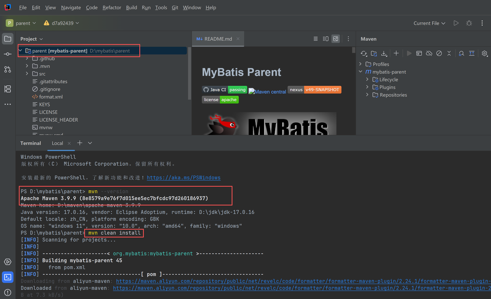

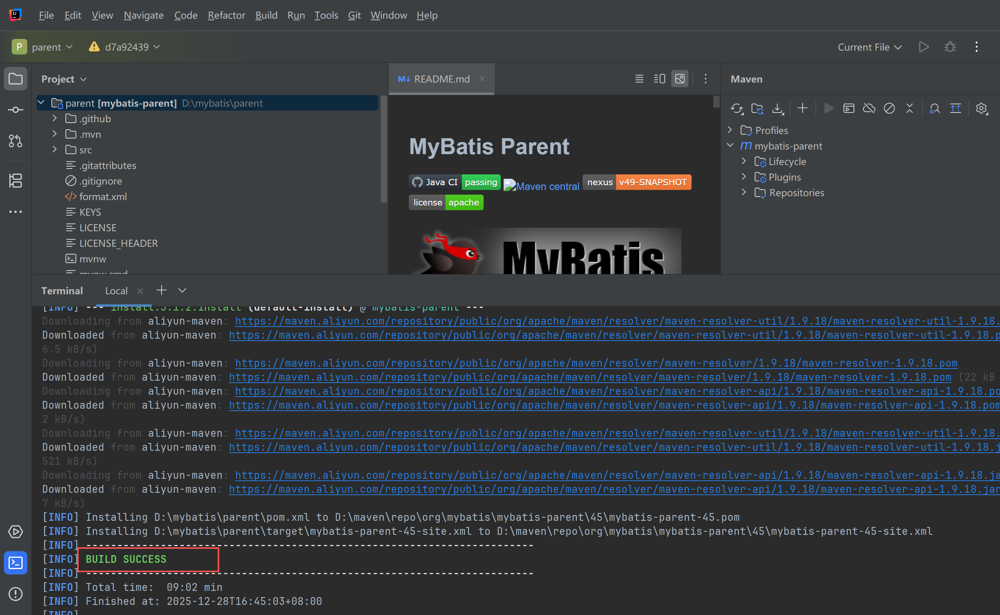

编译成功后，可以在本地仓库中看到 `mybatis-parent` 的编译结果 (我当前本地仓库的地址是: `D:\maven\repo\`)

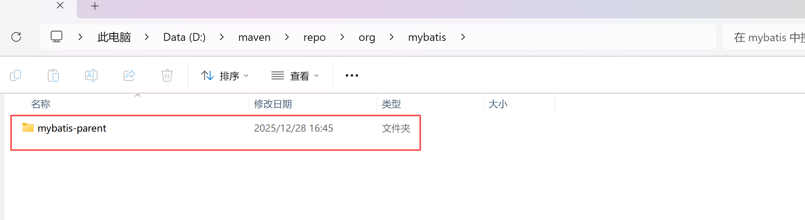

### 1.3 编译 `mybatis-3`

导入 `mybatis-3` 项目到 idea 中

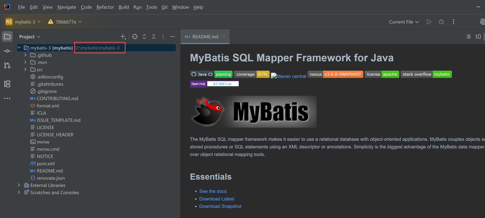

修改 [pom.xml](../source/mybatis/mybatis-3/pom.xml) 文件如下:

```xml
<!-- 修改 parent 依赖 -->
  <parent>
    <groupId>org.mybatis</groupId>
    <artifactId>mybatis-parent</artifactId>
    <version>45</version>
    <!-- 添加本地的parent依赖 -->
    <relativePath >../parent/pom.xml</relativePath>
  </parent>

<!-- 为了区分官方的版本，将自己编译的mybatis-3的版本修改为 -local 结尾 -->
<groupId>org.mybatis</groupId>
<artifactId>mybatis</artifactId>
<!-- 为了区分官方的版本，这里修改版本号为 -local 结尾 -->
<version>3.5.16-local</version>
```

执行如下命令: 

```shell
mvn clean install -DskipTests -Dcheckstyle.skip=true -Dpmd.skip=true 命令报错，修改如下命令
```
报如下错误:

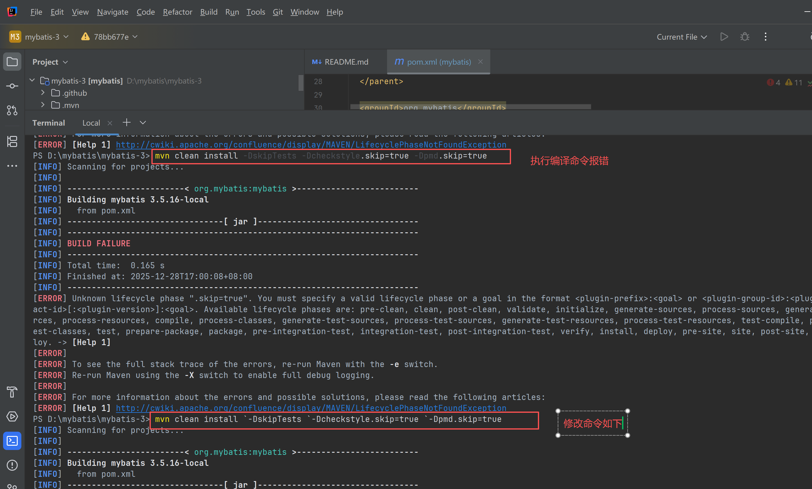

修改命令如下:

```shell
mvn clean install `-DskipTests `-Dcheckstyle.skip=true `-Dpmd.skip=true
```

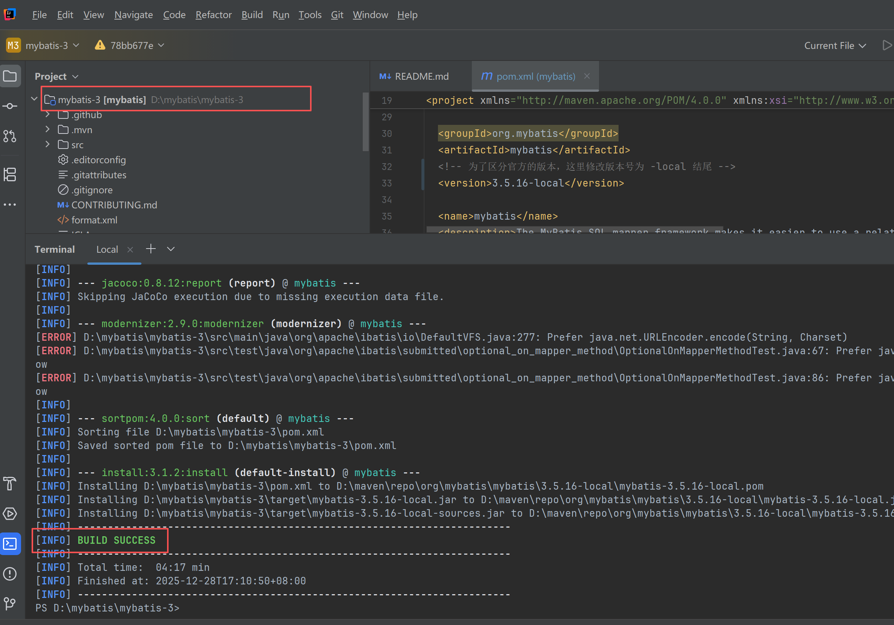

编译成功后，可以在本地仓库看到如下信息

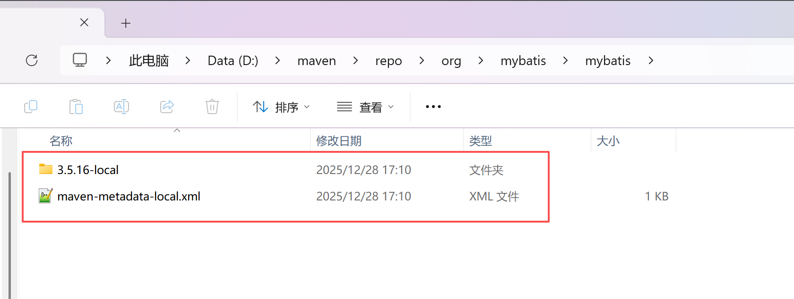


### 1.4 `mybatis-3` 关联本地源码

#### 1.4.1 迁移源码目录

将上述的 `mybatis-3` 和 `parent` 项目导入到 工程源码目录 [source](../source/mybatis) (这一步主要是为了一起上传后，download下来方便)

#### 1.4.2 配置 项目的 [pom.xml](./pom.xml) 文件

```xml
<!-- 导入 mybatis 核心包 -->
<dependency>
    <groupId>org.mybatis</groupId>
    <artifactId>mybatis</artifactId>
    <!-- 导入编译到本地仓库的maven版本 -->
    <version>3.5.16-local</version>
</dependency>
```

#### 1.4.3 配置源码，解决源码报错问题

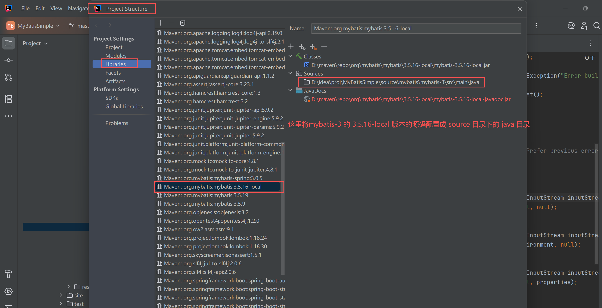

> 关联的源码报错问题解决

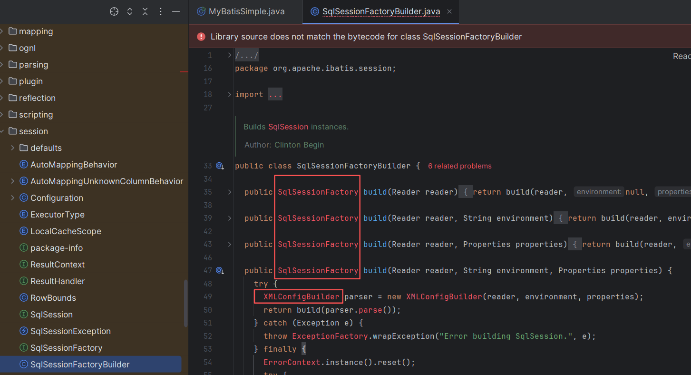

原因是因为 源码在工程目录内时，IDEA 会尝试编译这些源码文件，解决方案如下：

- 方案1: 将工程目录下的 `source/mybatis` 目录拷贝到工程外部，然后关联源码时关联这个外部的源码目录;
- 方案2: 配置 `source/mybatis/mybatis-3/src` 目录不参与编译;


此时再次打开源码，显示正常

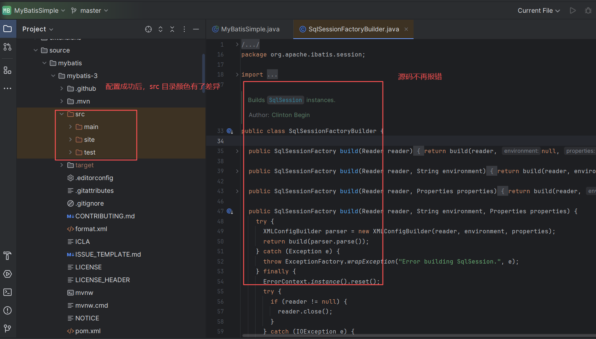


# `Mybatis` 源码分析

宏观上 `Mybatis` 代码可以分为: 基础支持层、核心处理层、接口层

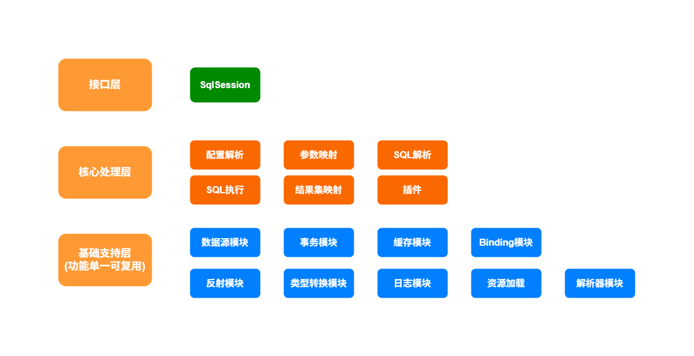

`Mybatis` 的主要工作流程如下:


`Mybatis` 初始化时的对象关联关系

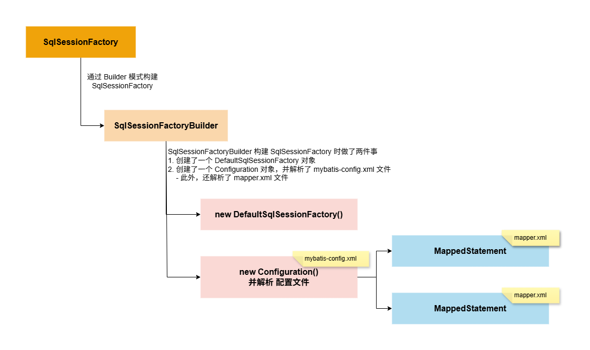


