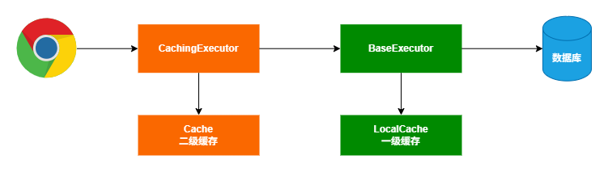

[toc]


# `Mybatis` 源码环境搭建

## 1. 下载 `mybatis-3` 和 `parent` 源码本地编译配置

### 1.1 下载 `mybatis-3` 和 `parent` 项目到本地目录下

项目仓库: https://github.com/orgs/mybatis/repositories


两个项目下载到同一个目录下


> 切换 `mybatis-3` 和 `parent` 的项目版本

- `mybatis-3`: 使用 `mybatis-3.5.16` tag 版本
- `parent`: 使用 `mybatis-parent-45` tag 版本

```text
# 查看所有的tag
git tag

# mybatis-3 切换到 mybatis-3.5.16 tag 版本
git checkout mybatis-3.5.16

# parent 项目切换到 mybatis-parent-45 tag 版本
git checkout mybatis-parent-45
```


### 1.2 导入 parent 项目到 idea，编译

导入 `mybatis-parent` 到 idea 中，执行如下命令: 

```shell
mvn clean install
```


首次执行，由于我本地的 maven 版本是 `3.8.6`，执行遇到如下问题:


重新配置 `maven` 版本到 `3.9.9` 后执行上述命令:


编译成功后，可以在本地仓库中看到 `mybatis-parent` 的编译结果 (我当前本地仓库的地址是: `D:\maven\repo\`)


### 1.3 编译 `mybatis-3`

导入 `mybatis-3` 项目到 idea 中


修改 [pom.xml](../source/mybatis/mybatis-3/pom.xml) 文件如下:

```xml
<!-- 修改 parent 依赖 -->
  <parent>
    <groupId>org.mybatis</groupId>
    <artifactId>mybatis-parent</artifactId>
    <version>45</version>
    <!-- 添加本地的parent依赖 -->
    <relativePath >../parent/pom.xml</relativePath>
  </parent>

<!-- 为了区分官方的版本，将自己编译的mybatis-3的版本修改为 -local 结尾 -->
<groupId>org.mybatis</groupId>
<artifactId>mybatis</artifactId>
<!-- 为了区分官方的版本，这里修改版本号为 -local 结尾 -->
<version>3.5.16-local</version>
```

执行如下命令: 

```shell
mvn clean install -DskipTests -Dcheckstyle.skip=true -Dpmd.skip=true 命令报错，修改如下命令
```
报如下错误:


修改命令如下:

```shell
mvn clean install `-DskipTests `-Dcheckstyle.skip=true `-Dpmd.skip=true
```


编译成功后，可以在本地仓库看到如下信息


### 1.4 `mybatis-3` 关联本地源码

#### 1.4.1 迁移源码目录

将上述的 `mybatis-3` 和 `parent` 项目导入到 工程源码目录 [source](../source/mybatis) (这一步主要是为了一起上传后，download下来方便)

#### 1.4.2 配置 项目的 [pom.xml](./pom.xml) 文件

```xml
<!-- 导入 mybatis 核心包 -->
<dependency>
    <groupId>org.mybatis</groupId>
    <artifactId>mybatis</artifactId>
    <!-- 导入编译到本地仓库的maven版本 -->
    <version>3.5.16-local</version>
</dependency>
```

#### 1.4.3 配置源码，解决源码报错问题


> 关联的源码报错问题解决


原因是因为 源码在工程目录内时，IDEA 会尝试编译这些源码文件，解决方案如下：

- 方案1: 将工程目录下的 `source/mybatis` 目录拷贝到工程外部，然后关联源码时关联这个外部的源码目录;
- 方案2: 配置 `source/mybatis/mybatis-3/src` 目录不参与编译;


此时再次打开源码，显示正常


# `Mybatis` 源码分析

宏观上 `Mybatis` 代码可以分为: 基础支持层、核心处理层、接口层


`Mybatis` 的主要工作流程如下:


`Mybatis` 初始化时的对象关联关系


## `mybatis` 源码解析

`mybatis` 执行如下的代码完成初始化，返回一个 `SqlSessionFactory` 对象;

`mybatis` 会经历一个完整的 **配置解析 -> 元数据构建 -> 工厂创建** 流程，其中 `mybatis-config.xml` 配置文件是整个流程的基石。

```java
InputStream in = Resources.getResourceAsStream("mybatis-config.xml");
SqlSessionFactory sqlSessionFactory = new SqlSessionFactoryBuilder().build(in);
```

### `XMLConfigBuilder` 配置文件节点加载

`mybatis-config.xml` 文件首先会被解析为 `XMLConfigBuilder` 对象，该对象创建的过程中会同步创建 `Configuration` 对象，此时的 `Configuration` 对象里面的属性都是默认值;

```java
// org.apache.ibatis.builder.xml.XMLConfigBuilder.java 

  private XMLConfigBuilder(Class<? extends Configuration> configClass, XPathParser parser, String environment,
      Properties props) {
    // XMLConfigBuilder 的构造方法中，创建了 Configuration 对象
    super(newConfig(configClass));
    ErrorContext.instance().resource("SQL Mapper Configuration");
    this.configuration.setVariables(props);
    this.parsed = false;
    this.environment = environment;
    this.parser = parser;
  }

  private static Configuration newConfig(Class<? extends Configuration> configClass) {
      try {
          // 当前 3.5.16 版本是通过反射创建 Configuration 对象
          return configClass.getDeclaredConstructor().newInstance();
      } catch (Exception ex) {
          throw new BuilderException("Failed to create a new Configuration instance.", ex);
      }
  }
```

### `XMLConfigBuilder.parse()` 解析入口

从根节点开始，将 `mybatis-config.xml` 配置文件中的自定义配置解析到 `Configuration` 对象中，每个 `XMLConfigBuilder` 只能调用一次 `parse()` 方法 (幂等性);

```java
// org.apache.ibatis.builder.xml.XMLConfigBuilder.java

  public Configuration parse() {
    if (parsed) {
      throw new BuilderException("Each XMLConfigBuilder can only be used once.");
    }
    // parse() 只能调用一次
    parsed = true;
    // 从根节点开始解析 mybatis-config.xml 配置文件
    parseConfiguration(parser.evalNode("/configuration"));
    return configuration;
  }
```

`parse()` 方法内部最终调用的是 `parseConfiguration()` 方法，从配置文件根节点开始解析配置文件

需要注意的是，`mybatis-config.xml` 配置文件中子标签的顺序是要求的，`parseConfiguration()` 按照固定的顺序解析每个子标签。

```java
// org.apache.ibatis.builder.xml.XMLConfigBuilder.java

  private void parseConfiguration(XNode root) {
    try {
      // issue #117 read properties first
      // 解析 properties 标签
      propertiesElement(root.evalNode("properties"));
      // 解析 settings 标签，这里拿到的数据是自定义配置的 settings 属性 （预处理）
      Properties settings = settingsAsProperties(root.evalNode("settings"));
      // 读取文件
      loadCustomVfsImpl(settings);
      // 日志设置
      loadCustomLogImpl(settings);
      // 类型别名设置
      typeAliasesElement(root.evalNode("typeAliases"));
      // 插件
      pluginsElement(root.evalNode("plugins"));
      // 对象工厂
      objectFactoryElement(root.evalNode("objectFactory"));
      // 对象加工
      objectWrapperFactoryElement(root.evalNode("objectWrapperFactory"));
      // 反射工具箱
      reflectorFactoryElement(root.evalNode("reflectorFactory"));
      // settings 子标签赋值，默认值就是在这里设置的
      // 这里的主要目的是将 settings 的配置赋值到 configuraion 对象中
      // 优先使用 settings 中的自定义属性值，如果没有自定义属性，则使用默认值
      settingsElement(settings);
      // read it after objectFactory and objectWrapperFactory issue #631
      // 加载数据源
      environmentsElement(root.evalNode("environments"));
      databaseIdProviderElement(root.evalNode("databaseIdProvider"));
      // 自定义类型处理器 Java 和 jdbc 类型转换
      typeHandlersElement(root.evalNode("typeHandlers"));
      // 解析引用的 Mapper 映射器
      mappersElement(root.evalNode("mappers"));
    } catch (Exception e) {
      throw new BuilderException("Error parsing SQL Mapper Configuration. Cause: " + e, e);
    }
  }

```

### `XMLConfigBuilder.propertiesElement()` 解析自定义键值对

`mybatis-config.xml` 配置文件中，可以将常用的配置通过自定义键值对的形式定义，键值对定义的位置如下:

1. `XMLConfigBuilder` 构造函数动态传入 `Properties` 对象: ;
```java
// org.apache.ibatis.builder.xml.XMLConfigBuilder.java

public XMLConfigBuilder(Reader reader, String environment, Properties props) {
    this(Configuration.class, reader, environment, props);
}
```

2. 自定义 `*.properties` 文件导入
```xml
<?xml version="1.0" encoding="UTF-8" ?>
<!DOCTYPE configuration
        PUBLIC "-//mybatis.org//DTD Config 3.0//EN"
        "https://mybatis.org/dtd/mybatis-3-config.dtd">
<configuration>
    <!--
        导入 jdbc.properties 配置文件，后续可以在当前文件使用使用 ${key} 的方式读取配置数据
    -->
    <properties resource="jdbc.properties"/>
</configuration> 
```

3. 通过内联子标签定义
```xml
<?xml version="1.0" encoding="UTF-8" ?>
<!DOCTYPE configuration
        PUBLIC "-//mybatis.org//DTD Config 3.0//EN"
        "https://mybatis.org/dtd/mybatis-3-config.dtd">
<configuration>
    <properties resource="jdbc.properties">
        <!-- 如果 resource/url 对应文件的 key/value 和当前文件配置的冲突了，则以 resource/url 文件中的为准 -->
        <property name="jdbc.username" value="admin"/>
        <property name="jdbc.password" value="123"/>
    </properties>
</configuration>
```
自定义的键值对在后续的配置文件中使用 `${key}` 占位符的形式引入自定义配置的属性值;

上述三种方式，如果定义的 `key` 重复了，则按照 **构造函数传入 > `*.properties`配置文件导入 > 内联定义** 的优先级覆盖对应的 `key`

```java
// org.apache.ibatis.builder.xml.XMLConfigBuilder.java

  private void propertiesElement(XNode context) throws Exception {
    if (context == null) {
      // properties 属性可以为空
      return;
    }
    // 读取内联配置
    Properties defaults = context.getChildrenAsProperties();
    // <properties resource="jdbc.properties"/>
    String resource = context.getStringAttribute("resource");
    // <properties url="http://xxxx"/>
    String url = context.getStringAttribute("url");
    if (resource != null && url != null) {
      // properties 不能同时配置 resource 和 url 属性
      throw new BuilderException(
          "The properties element cannot specify both a URL and a resource based property file reference.  Please specify one or the other.");
    }
    // 如果外部配置文件的 key 和 内联属性的 key 冲突，则会使用外部配置文件的 key-value 覆盖掉内联配置的 key-value
    if (resource != null) {
      // 从 properties 文件中加载配置属性
      defaults.putAll(Resources.getResourceAsProperties(resource));
    } else if (url != null) {
      // 从 url 中加载 properties 属性
      defaults.putAll(Resources.getUrlAsProperties(url));
    }
    Properties vars = configuration.getVariables();
    if (vars != null) {
      // var != null 表示有从java代码传递属性进来，new SqlSessionFactoryBuilder().build(inputStream, props);
      // 合并 java 代码传递进来的 properties 属性，通过 Java 代码配置的属性优先级最高
      defaults.putAll(vars);
    }
    // 更新属性信息，用于后续 XML 占位符属性值的替换
    parser.setVariables(defaults);
    // 保存属性到 configuration 对象中
    configuration.setVariables(defaults);
  }
```

### `<settings/>` 自定义属性处理

`<settings/>` 标签处理分为两个阶段
1. `XMLConfigBuilder.settingsAsProperties()` 读取自定义属性并校验合法性(`key`在`Configuration`有对应的 `Setter`);
2. `XMLConfigBuilder.settingsElement()` 将自定义属性合并到系统默认的属性配置;

```java
// org.apache.ibatis.builder.xml.XMLConfigBuilder.java

private void settingsElement(Properties props) {
    configuration
            .setAutoMappingBehavior(AutoMappingBehavior.valueOf(props.getProperty("autoMappingBehavior", "PARTIAL")));
    configuration.setAutoMappingUnknownColumnBehavior(
            AutoMappingUnknownColumnBehavior.valueOf(props.getProperty("autoMappingUnknownColumnBehavior", "NONE")));
    // 配置文件的缓存默认开启，默认是开启的
    configuration.setCacheEnabled(booleanValueOf(props.getProperty("cacheEnabled"), true));
    configuration.setProxyFactory((ProxyFactory) createInstance(props.getProperty("proxyFactory")));
    // ....
}
```


## 缓存



mybatis 缓存可分为一级缓存和二级缓存


